# **Physical vulnerabilities in modern Optical Networks**

This repository covers a series of vulnerabilities present in fiber optic communications network structure and equipment allowing attackers to jam, eavesdrop, and spoof other users signals ([TV, Landline phone, and Internet traffic](https://en.wikipedia.org/wiki/Triple_play_(telecommunications))). The attacks presented here can be stealthily carried out in *Fiber To The Home* (FTTH) networks with no manipulation of ISP infrastructure and moderate resources. OptiSystem simulations are provided.

 

 

## **Sections**

* [Background](#Background) 
* [Vulnerabilities in TDM-PON networks](#Vulnerabilities-in-TDM-PON)
* [Vulnerabilities in WDM-PON networks](#Vulnerabilities-in-WDM-PON)
* [Eavesdropping device](#Eavesdropping-device)

---

&nbsp;

## **Background**

Optically based network technologies are globally replacing conventional electrical cabling in the telecommunications industry due its higher bandwidth, noise peformance and reach, required to meet demand trends. Fiber optic is often praised by the security community due to its very high electromagnetic noise resilience that renders some conventional side channel attacks such as the ones proposed [here](https://github.com/zadewg/deside) infeasible. 

This is a misleading truth. 

First, note that classic [TEMPEST](https://en.wikipedia.org/wiki/Tempest_(codename)) oportunities might still arise in the electronic TX and RX equipment present at the edge of the optical networks. Moreover, in the case of the so-called *Active Optical Networks* (AONs, that use electronic equipment instead of passive optical equimpent to redirect the optical signals) this attack oportunity extends to points away from the network ends, making it significantly more operationally feasible. 

Second and most importantly, this resilience against external sources of noise makes the observable noise in an optical network largely attributable to internal sources &mdash;other data channels&mdash; due to crosstalk. Exploiting this crosstalk for eavesdropping in conventional electrical networks is often virtually impossible because the external noise floor is above the crosstalk level.

TDM                        |  WDM
:-------------------------:|:-------------------------:
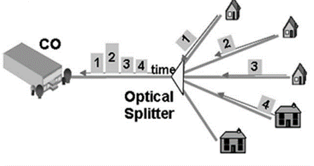     |  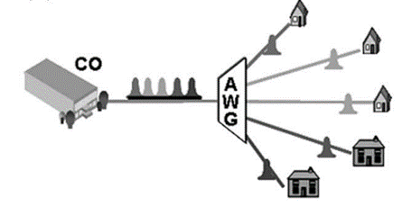

Two widely deployed technologies on FFTH newtorks are TDM-PON and WDM-PON, time and frequency division multiplexing, respectively. See [this](https://en.wikipedia.org/wiki/Time-division_multiple_access) and [this](https://en.wikipedia.org/wiki/Frequency-division_multiplexing) if unfamiliar with multiplexing. Both technologies are covered in this work, and where standard-specific discussion becomes relevant an emphasis is be made on GPON, arguably the most popular implementation nowadays. Above images stolen from [here](http://www.hit.bme.hu/~jakab/edu/litr/Access/PON/TDM_PON_04063414.pdf).

 <!-- multiplexing and multiple access technologies are not the same, but the later is linked to because the explanation is clearer -->

Passive Optical Newtorks (PON) are considered because of their popularity and simplicity of explanation, nonetheless, the proposed eavesdropping attacks have the same impact in active networks. Jamming and injection attacks might be more easily defended in AONs, as mechanisms that do not require ONT cooperation [have been proposed](https://ieeexplore.ieee.org/document/4150993) to detect and disconnect service degrading equipment.

&nbsp;

### **Vulnerabilities in TDM-PON networks**

TDM-PON is implemented using a point-to-multipoint (P2MP) network architecture. This means that every client in a branch receives all downstream data in that branch. Because of this AES-128 encryption is often implemented on the downlink, but not always. This encryption is sugested in the GPON standard, but not in EPON, BPON.

If no encryption is present, a malicious user is then able to simply use some other user's time slot and send and receive all traffic as him. Attempting bruteforce on AES-128 is not an option for the forseeable future and no vulnerability is publicly known, however, AES being a symmetric algorithm means that both the provider's CO end (OLT) and the users end (ONT/ONU) must know the key, so compromising or collaborating with the ISP or [reverse engineering](https://pierrekim.github.io/blog/2016-11-01-gpon-ftth-networks-insecurity.html) the ONT for shared or predictable keys will compromise all users.

Also note that only the payload section is encrypted, and hence headers will always provide useful metadata in cleartext. The last, and perhaps most interesting consideration, is that the standard does not contemplate encryption in the uplink, because in that flow direction the architecture is point-to-point. This unnecrypted uplink is subject to traffic injection and jamming, but also to eavesdropping due to crosstalk and reflections present in all networks, further details about crosstalk are discussed in the [WDM](#Vulnerabilities-in-WDM-PON) section. Crosstalk and reflections in the network also allow for channel selective jamming (Denial of Service).

 
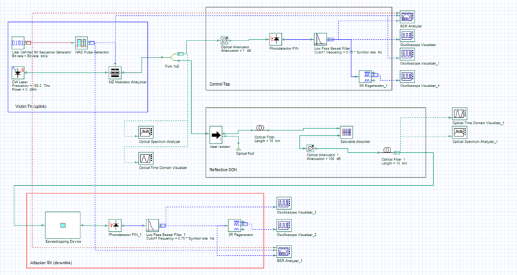

The [system above](./uplink_refelction.osd) showcases the exploitation of reflections within the network to eavesdrop on uplink traffic. Reflections occur when there is a change in the refractive index and the angle formed between the interface normal and the axis of propagation of light is within the critical angle of refraction, as according to Snell's Law. This is known as [Fresnel reflection](https://en.wikipedia.org/wiki/Fresnel_equations) and happens on the interface of virtually all components along the network, on splices, and most significantly on dirty or unplugged optical connectors. I suspect [Rayleigh Backscattering](https://en.wikipedia.org/wiki/Rayleigh_scattering) may be exploited too with sensitive enough equipment, as done by [OTDRs](https://en.wikipedia.org/wiki/Optical_time-domain_reflectometer). In the provided system the reflection is represented by a saturable absorber and an optical attenuator, yielding a conservative -100 dB reflection. The [eavesdropping device](#Eavesdropping-device) here is used only for gain, and filters must be tuned to the uplink band. Original and eavesdropped data is shown below, the transmitted sequence 010110111 is fully recovered. 

Victim                        |  Attacker
:-------------------------:|:-------------------------:
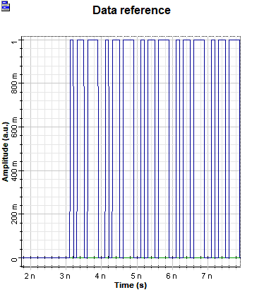     |  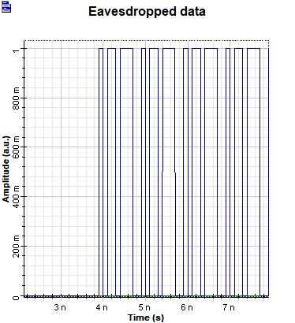

A bit rate of 10 Gbps is used for the example above, with nanosecond propagation delay clearly visible even with a link length of only 10Km. It becomes apparent that race conditions may also be [exploitable](https://wikileaks.org/hackingteam/emails/fileid/447727/212805) at GPON speeds. It was previosuly mentioned that connectors are a significant source of reflections, common connector types and their return loss (reflection) are shown below&mdash;again, dirty or unplugged connectors provide much higher reflection, making this attack very feasible. A simulink model contribution of unplugged or dirty (dust, oil) connectors will be greatly appreciated. Figure stolen from [here](http://osd.com.au/angled-physical-contact-apc-connectors/).

 

 &nbsp;

 
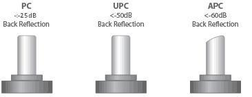

The **huge problem** with uplink eavesdropping is that [downlink AES keys are transmitted in clear, periodically](https://support.huawei.com/huaweiconnect/carrier/en/thread-446019.html). The two vulnerabilities presented here can be combined by an attacker to take full control of a victim's uplink and downlink, and then even identify as itself to the ISP, effectively stealing the connection.  <!-- I suspect that even if the reflection is not strong enough for the attacker to pick up keys transmitted in the uplink, because this link is unnecrypted, the attacker may attempt to flood-advertise keys spoofing all clients, hoping that the OLT may accept some, leading ONUs to use attacker controlled keys. -->

### **Vulnerabilities in WDM-PON networks**

WDM-PON employs a a Point-to-Point (P2P) architecture and hence encryption is not inmediatly needed. For this reason it is often considered a more secure alternative to TDM-PON. Note that if encryption was to be used, the attacks described in the previous section do still apply. As with TDM-PON, the uplink may be eavesdropped due to reflections in the *Optical Distribution Network* (ODN) &mdash; as a matter of fact WDM-PON uplinks are often not WDM, but TDMA (Hybrid-PON). The same jamming and race condition oportunities do still exist too. This section covers the exploitation of the crosstalk present in the network to eavesdrop on the downlink. The system below represents a simple 2.5 GHz WDM-PON link with a malicious user targeting a user in its neighbourhood. A more complete network is also [provided](WDM_PON_BSL_layout.osd).

&nbsp;

 
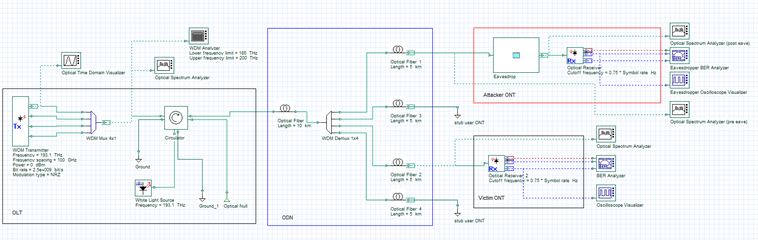

&nbsp;

Four 100 GHz-separated channels are used in the 1.55um band (193.1-.4 THz). The attacker places an [eavesdropping device](#Eavesdropping-device) right before its ONT, and sniffs on the traffic of a neighbour two channels appart &mdash; the attacker's legitimate WDM channel is at 193.1 THz, and the victim's at 193.3 THz. Note that the narrower the channel spacing the larger the crosstalk effect, typical WDM implementations use up to 40 channels at the provided spacing, and up to 80 with narrower (50 GHz) spacing. Channel spacing may be further reduced in the future, increasing crosstalk levels, but requiring more selective filters for eavesdropping. The figures below show the optical frequency spectrum of the incoming signal before and after the eavesdropping device, and also before and after the mux/demux.

After Mux | Before Demux               |  Before Eavesdropper      |  After eavesdropper
:-------------------------:|:-------------------------:|:-------------------------:|:-------------------------:
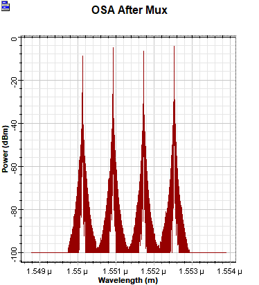     |  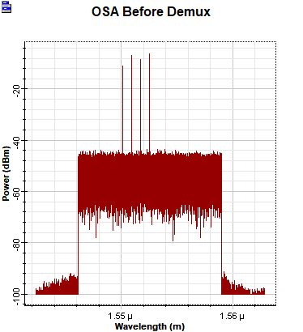   | 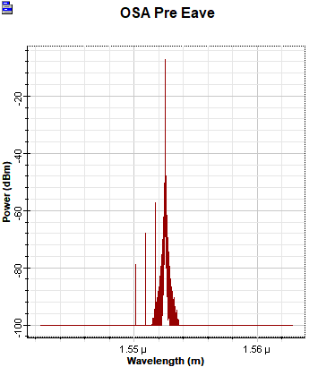 | 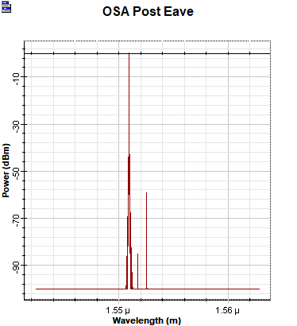

A typical WDM spectrum can be seen after the multiplexer. The noise seen before the demux is caused by the *Broadband Light Source* (BLS) used in some networks and here, to further non-idealize the attack scenario. The spectrum at the attacker's premises shows that a considerable amount of crosstalk is present, measured around -65 dB for the targetted channel. An eavesdropping device is able to filter and amplify the target signal, with the new peak corresponding to the victim's channel. This can be then fed to a conventional ONT for decoding. BER and eye diagram of the eavesdropped signal as well as those from the victim's side are provided below.

Reference Signal Quality                        |  Eavesdropped Signal Quality
:-------------------------:|:-------------------------:
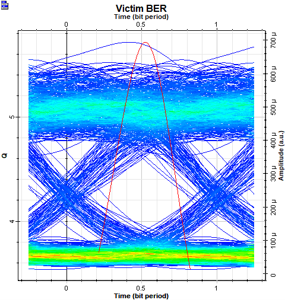     |  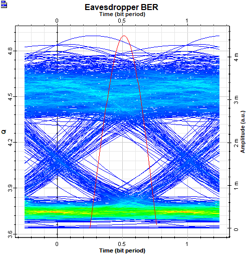

Remarkable signal quality at the eavesdropper is observed, slightly lower than the legitimate signal at the victim's ONT. Higher signal quality, potentially higher than that at the victim's end, can be achieved with better filters and amplifiers in the [eavesdropping device]() &mdash; two 10GHz bandwidth second order Bessel filters and a simple [TWA SOA](https://www.inphenix.com/en/semiconductor-optical-amplifiers/) are used in the test setup. The transmitted messages can be eavesdropped seamlessly, with no statistical analysis required to decode packets. Digitalized samples are shown below. Note that, as with TDM-PON, being able to listen to upstream and downstream traffic can lead to a complete takeover of the legitimate ONT in GPON and other popular PON standards.

Victim                        |  Attacker
:-------------------------:|:-------------------------:
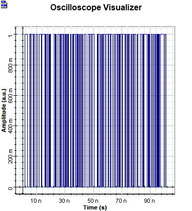     |  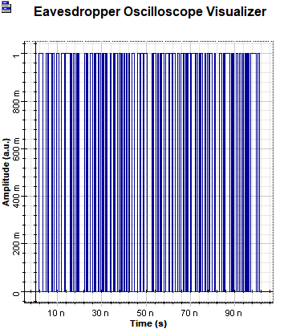

The full transmitted sequence is recovered reliably. Virtually all passive components in the network experience crosstalk, it is unavoidable. A problem with crosstalk is that its effect is cumulative, and hence the bigger the network often the bigger the crosstalk levels. Filtering is expensive and so networks and equipment are often designed to avoid signal degradation due to crosstalk, but not to protect against eavesdropping. Significant sources of crosstalk in a WDM network are all couplers, and Mux/Demux components. The fiber optic itself may also introduce crosstalk due to [Raman Scattering](https://en.wikipedia.org/wiki/Raman_scattering), more significantly on high power/long distance networks. This effect is showcased at the end of this section, although convenient channel frequencies are chosen to exagerate the effect. Note that the increased amplitude of signals creates an eavesdropping oportunity as line coding is used, hence the amplitude or phase will change depending on the transmitted data. The provided simulation also contemplates self-phase modulation ([SPM](https://en.wikipedia.org/wiki/Self-phase_modulation)), cross-phase modulation ([XPM](https://en.wikipedia.org/wiki/Cross-phase_modulation)), and first and second order group velocity dispersion ([GVD](https://en.wikipedia.org/wiki/Group_velocity_dispersion)) effects. I suspect this effect can also be exploited to perform out of band tapping, bypassing some tap detection techniques.

An overview of different WDM technologies can be found [here](https://www.intechopen.com/books/multiplexing/optically-multiplexed-systems-wavelength-division-multiplexing). Depending on the method and technology in use, Mux/Demux crosstalk can be attributted to the inherent crosstalk of couplers and insufficient filtering on interference-based devices, and excessive channel bandwidth on difraction-based devices. 

Beginning of fiber                        |  End of fiber
:-------------------------:|:-------------------------:
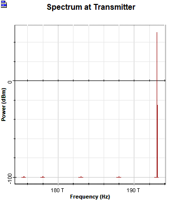     |  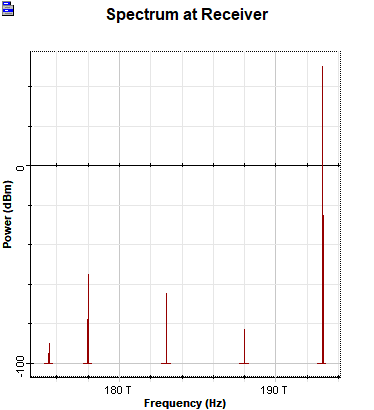

### **Eavesdropping device**

Optical communication implementations differ among manufacturesrs and so the ONT/ONU must be the same brand as the OLT on the ISP's side. The eavesdropping device assumes the attacker has access to a legitimate ONT&mdash;a reasonable asumption provided access to the fiber to the home is needed to carry out the attacks without modifying network infrastructure.

 
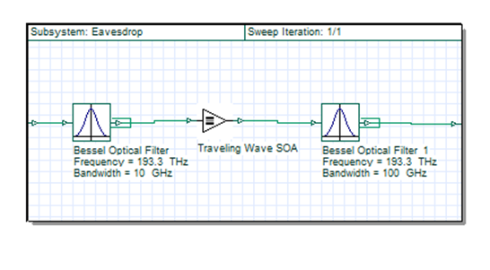

The eavesdropping device can be seen above. The sole purpose of this device is to isolate and amplify the targeted chanel. It is composed of two 10GHz bandwidth second order Bessel filters and a [TWA SOA](https://www.inphenix.com/en/semiconductor-optical-amplifiers/), although the second filter is mainly there to remove noise introduced by the amplifier and first order 100 GHz bandwidth  will suffice at the 100 GHz channel spacing used&mdash;50 GHz channel spacing networks will require more selective filtering. Silicon Optical Amplifiers do not offer the best performance but prove to be sufficient for the application and are compact, realtively cheap and accessible.

Tunable filters and a spectrum analyzer, OTDR, or prior intelligence is required to exploit the vulnerabilities in the field. Equipment cost is on the thousands-of-dollars range and small enough to be concealed in backpacks.

&nbsp;

---

Info about real implementation examples of these networks is appreciated. You can contact me on  [telegram](https://t.me/mapezz) - **mapez**.

